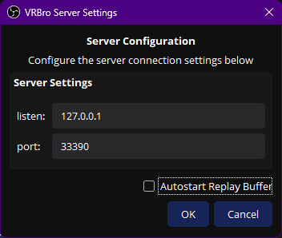

# VRBro Plugin for OBS Studio

## Introduction

VRBro Plugin is an OBS Studio plugin designed to bridge the gap between virtual reality and content creation. 
It works in tandem with a ([SteamVR Overlay App](https://github.com/99oblivius/VRBro-Overlay)) to provide seamless control of OBS Studio directly from within VR.

## Installation

1. Download the latest release of the VRBro Plugin from the [Releases](https://github.com/99oblivius/VRBro-plugin/releases) page.
2. Run the installer or extract the contents of the zip file to your OBS Studio plugins folder:
   - Windows: `C:\Program Files\obs-studio\obs-plugins\64bit\`
   - macOS: `/Applications/OBS.app/Contents/PlugIns/`
   - Linux: `/usr/lib/obs-plugins/` or `~/.obs-studio/plugins/`
3. Restart OBS Studio.

## GUI

## Features

- Creates and manages a simplified WebSocket server for fast, performant control of OBS from in-game VR environments
- Enables VR users to control OBS functions without leaving their VR experience
- Supports various OBS actions such as starting/stopping streaming, recording, and replay buffer
- Provides a user-friendly settings interface within OBS Studio

## How It Works

1. The VRBro Plugin sets up a WebSocket server within OBS Studio.
2. A companion SteamVR overlay application (sold separately) connects to this WebSocket server.
3. VR users can configure their VR controller bindings to send commands to OBS via the overlay.
4. The plugin receives these commands and executes the corresponding actions in OBS Studio using the Frontend API.

## Configuration

1. In OBS Studio, go to Tools > VRBro Server Settings.
2. Enable the "Auto Buffer" feature to automatically start the replay buffer when OBS loads, if desired.
3. Optionally, set a custom listening address and port for the WebSocket server.

## Usage

1. Launch OBS with VRBro plugin installed 
   a. (Help -> Log Files -> View Current Log) To verify the server is running successfully if issues arise. 
2. Launch SteamVR.
3. Launch VRBro Overlay.
4. Use your VR controller bindings to send commands to OBS.

## Supported Commands

- Start/Stop Streaming
- Start/Stop Recording
- Start/Stop Replay Buffer
- Save Replay Buffer
- Split Recording File

## Contributing & Feedback

Contributions and or issues are welcome! Feel free to submit a Pull Request.

## Acknowledgements

- OBS Studio team for their excellent software and API
- Asio and nlohmann/json library authors
